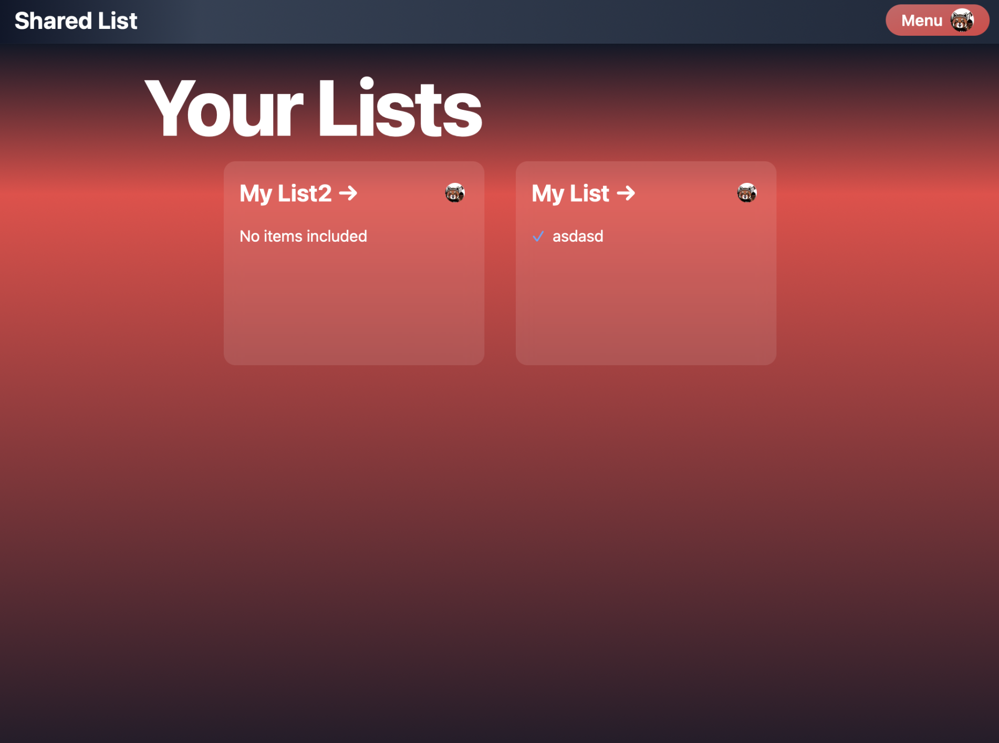
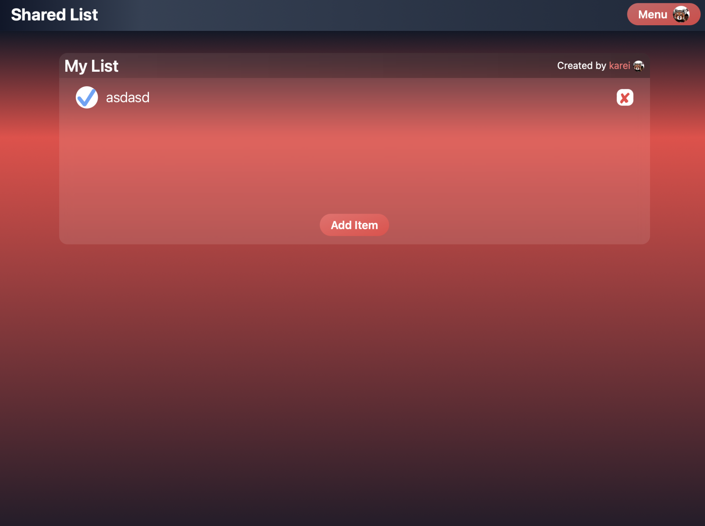
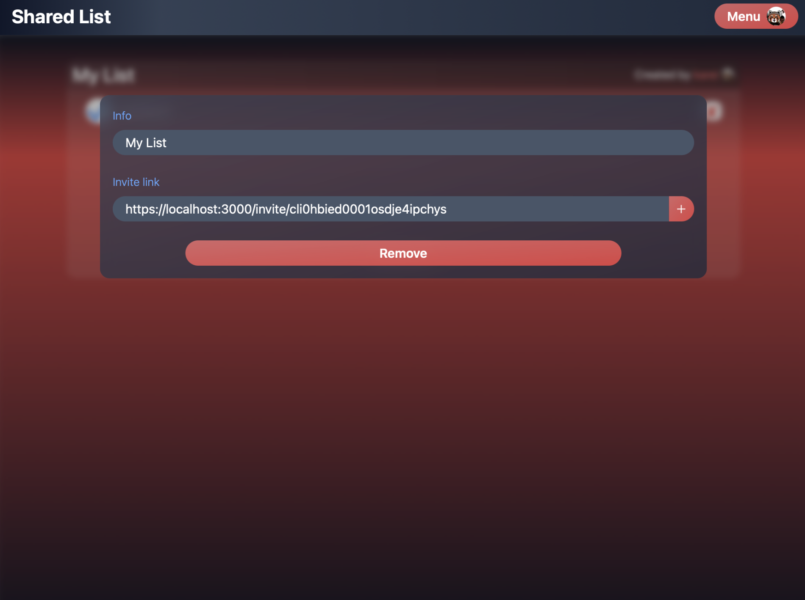

# Shared list
Web application for managing and sharing lists with others.

Basic checklists that are stored under your Discord account.

Lists can be shared with other people via a link, which will then add it to their home view as well.

Created with the [T3 Stack](https://create.t3.gg/), utilising the following components:
- [Next.js](https://nextjs.org)
- [NextAuth.js](https://next-auth.js.org)
- [Prisma](https://prisma.io)
- [Tailwind CSS](https://tailwindcss.com)
- [tRPC](https://trpc.io)
